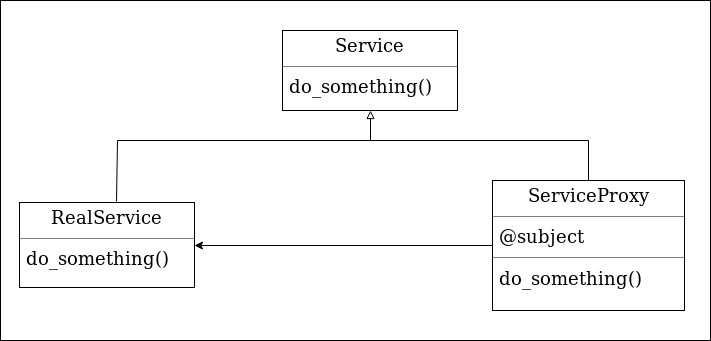
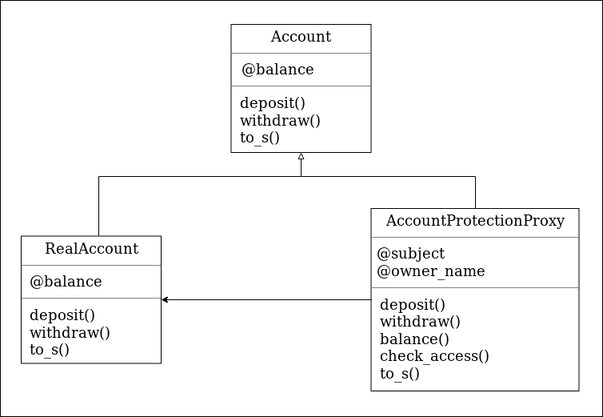

# Praxisteil Präsentation Software-Architektur :gem:
## Refactoring @ Markus 
Ziel dieser Übung ist es Quellcode zu refactoren, der den Kriterien für *Zen of Ruby* genügt.
- [zu überarbeitender Quellcode](./refactoring_sample/main_refactored.rb)
- [Überarbeiteter Quellcode](./refactoring_sample/main_refactored.rb)
- [Weiterführende Informationen zu gutem Ruby Code](http://www.zenruby.info/)

Quelle: [hier](http://www.codeacademy.com)

## Mitmach-Übung @ Philipp / Markus
### Beschreibung
In Deutschland gelten nachfolgende Regeln für die Bildung einer Rettungsgasse. Wenn es nur eine Spur gibt, sollte jeder nach rechts fahren, sodass die Rettungsfahrzeuge auf der linken Seite vorbeifahren können.
Wenn es zwei oder mehr Spuren gibt, sollten die Autos auf der linken Fahrspur nach links fahren und alle anderen sollten sich nach rechts bewegen. Die Regeln lassen sich wie folgt visualisieren:
```
1 🚔🚘
2 🚘🚔🚘
3 🚘🚔🚘🚘
4 🚘🚔🚘🚘🚘
5 🚘🚔🚘🚘🚘🚘
6 🚘🚔🚘🚘🚘🚘🚘
```
Eure Aufgabe ist es, ein Programm zu erstellen, das eine Ausgabe wie oberhalb erzeugt. Die Anzahl der Fahrspuren soll dabei
veränderlich sein. Anstelle der Emojis können auch Buchstaben oder Zahlen verwendet werden.

### Hilfreiche Hinweise
```
# Erzeugen und Ausgabe von Unicode Auto und Polizeiauto-Emoji
puts "\u{1F698 1F694}"
```
### Quellcode
- [Online IDE](https://www.tutorialspoint.com/execute_ruby_online.php)
- keine Vorlage
- [Lösungsvorschläge](./interactive_sample/proposals.rb)

Quelle: [hier](https://codegolf.stackexchange.com/questions/161281/make-an-emergency-corridor/161326
)

## Übung mit Muster @ Philipp

### Das Proxy Pattern

- gehört zur Kategorie der Strukturmuster
- Zweck ist Bereitstellung eines vorgelagerten Stellverteter-Objekts
- Stellvertreter-Objekt steuert den Zugang zu Objekt
- Es existieren verschiedene Arten: Protection Proxy, Remote Proxy, Virtual Proxy
- Protection Proxy: Zugangskontrolle, Schutz von Informationen
- Remote Proxy: Fernzugriff auf Objekte
- Virtual Proxy: Zeitverzögerte Instanziierung von Objekten


#### Klassendiagramm des Proxy Patterns



#### Klassendiagramm des Proxy Patterns für den Use Case _Protection Proxy für den Zugriff auf ein Bankkonto_



Quellen: 
[Blog](https://bogdanvlviv.com/posts/ruby/patterns/design-patterns-in-ruby.html#proxy)
[Buch](https://learning.oreilly.com/library/view/design-patterns-in/9780321490452/)

## Backup @ Philipp / Markus
### Beschreibung
Die Aufgabe ist es, eine bestimmte Zeichenkette zu sortieren. Jedes Wort in der Zeichenkette enthält eine einzelne Zahl. Diese Zahl ist die Position, die das Wort im Ergebnis haben sollte. 
Die Zahlen können von 1 bis 9 sein. 1 wird also das erste Wort sein. Wenn die Eingabezeichenkette leer ist, geben Sie eine leere Zeichenkette zurück. Die Wörter in der eingegebenen Zeichenkette enthalten nur gültige fortlaufende Zahlen. Nachfolgend ist die Funktionsweise dargestellt:

```
"is2 Thi1s T4est 3a"  -->  "Thi1s is2 3a T4est"
"4of Fo1r pe6ople g3ood th5e the2"  -->  "Fo1r the2 g3ood 4of th5e pe6ople“
```

### Hilfreiche Hinweise
```
# Aufteilen von Strings mittels Regex z. B. am Buchstaben i
string.split /[i]/
# Sortieren eines Arrays z. B. arr.sort{|x,y|block}. Block kann als Lambda oder mittels Spaceship-Operator implementiert sein.
arr.sort{|x,y|y <=> x}
# Verketten von Elementen eines Arrays mit Kommas
arr.join(",")
```
### Quellcode
- keine Vorlage
- [Lösungsvorschläge](./backup_sample/backup_sample.rb)

Quelle: [hier](https://www.codewars.com/kata/your-order-please/ruby)

## Weiterführende Links
- http://rubykoans.com/windows
- https://rubymonk.com/
